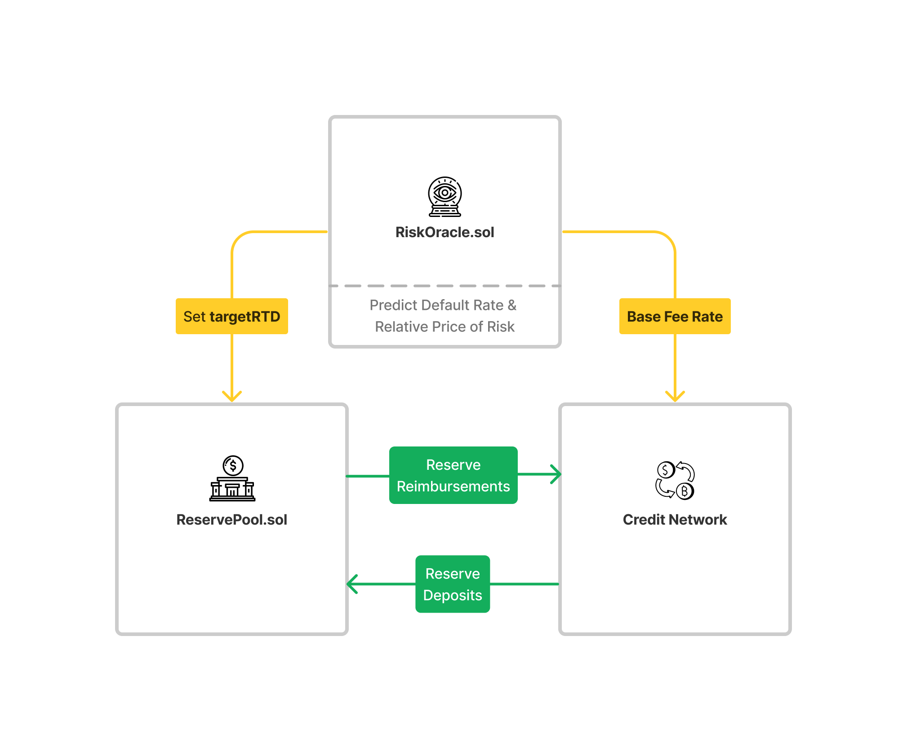

```
   _____       _____
  |  __ \     / ____|
  | |__) |___| (___   ___  _   _ _ __ ___ ___
  |  _  // _ \\___ \ / _ \| | | | '__/ __/ _ \
  | | \ \  __/____) | (_) | |_| | | | (_|  __/
  |_|  \_\___|_____/ \___/ \__,_|_|  \___\___|
```

# ⚠️ ReSource Risk Management

The following decentralized infrastructure is responsible for providing on-chain credit networks with the means to autonomously manage credit risk. This is achieved by enabling credit networks to contribute to a **Reserve** that is responsible for storing reserve deposits that are to be used to incentives the reduction of bad debt. For an example of how an on-chain credit network can manage bad debt, check out the [ReSource Stable Credit Protocol](https://github.com/resourcefinance/stable-credit).

#### Analyze, Predict, Mitigate

Credit risk is mitigated by monitoring and analyzing a given credit network in order to calculate both the needed reserve size, as well as the rate at which it is filled with deposits. The size of a given reserve is measured by its **Reserve To Debt Ratio** (`RTD`) and the deposit rate is translated to a `baseFee` that should be charged per credit tx at any given moment.

📕 For more information on **ReSource Risk Mitigation** go to the [docs](https://docs.resource.finance/stable-credit/credit-risk).

## Protocol Overview

---

The following diagram depicts how **Stable Credit** networks interact with the **ReSource Risk Management** protocol to stabilize their credit currencies.


---

## Contracts:

- **`ReservePool.sol`**: Responsible for storing and transferring a network's reserve tokens in order to back the credit currency.
- **`ReserveRegistry.sol`**: Responsible for maintaining a list of reserves that are to be analyzed and maintained by the ReSource Risk Management infrastructure.
- **`RiskOracle.sol`**: Responsible for exposing calculated network risk data.

# 🏄‍♂️ Quick Start

This project uses [Foundry](https://github.com/foundry-rs/foundry) for the development framework and [Hardhat](https://github.com/NomicFoundation/hardhat) for deployment.

#### Dependencies

```
yarn install
```

```bash
forge install
```

#### Compilation

```bash
forge build
```

#### Testing

```bash
forge test
```

#### Deploy

```bash
yarn deploy
```
