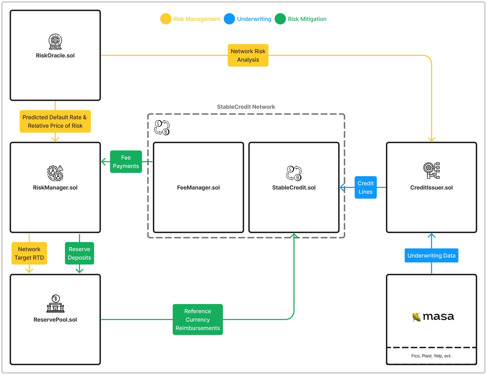

```
   _____       _____
  |  __ \     / ____|
  | |__) |___| (___   ___  _   _ _ __ ___ ___
  |  _  // _ \\___ \ / _ \| | | | '__/ __/ _ \
  | | \ \  __/____) | (_) | |_| | | | (_|  __/
  |_|  \_\___|_____/ \___/ \__,_|_|  \___\___|
```

# ⚠️ ReSource Risk Management

The following decentralized infrustrucutre is responsible for providing **ReSource Stable Credit** networks with the means to analyze, predict, and mitigate credit risk within a mutual credit context.

To accomplish this, this protocol interfaces with the **ReSource Stable Credit** protocol and **Masa Finance** protocol.

📕 For more information on ReSource and Stable Credits go to https://www.resource.finance/

## Protocol Overview

---

The following diagram depicts how **Stable Credit Networks** interact with the **ReSource Risk Managment** protocol to stabalize their credit currencies.  


---

## Contracts:

- **`RiskManager.sol`**: Responsible for referencing risk analysis provided by the `RiskOracle` contract to update network risk variables (ex. BaseFee, target RTD).
- **`ReservePool.sol`**: Responsible for storing and transfering network reference tokens.
- **`RiskOracle.sol`**: Responsible for exposing .
- **`CreditIssuer.sol`**: Responsible for underwriting network participants to issue credit terms (note: base implementation intended to be extended)

# 🏄‍♂️ Quick Start

This project uses [Foundry](https://github.com/foundry-rs/foundry) as the development framework.
####Dependencies

```bash
forge install
```

####Compilation

```bash
forge build
```

####Testing

```bash
forge test
```
